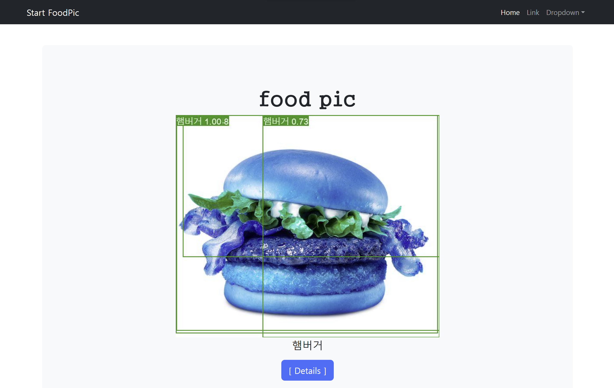
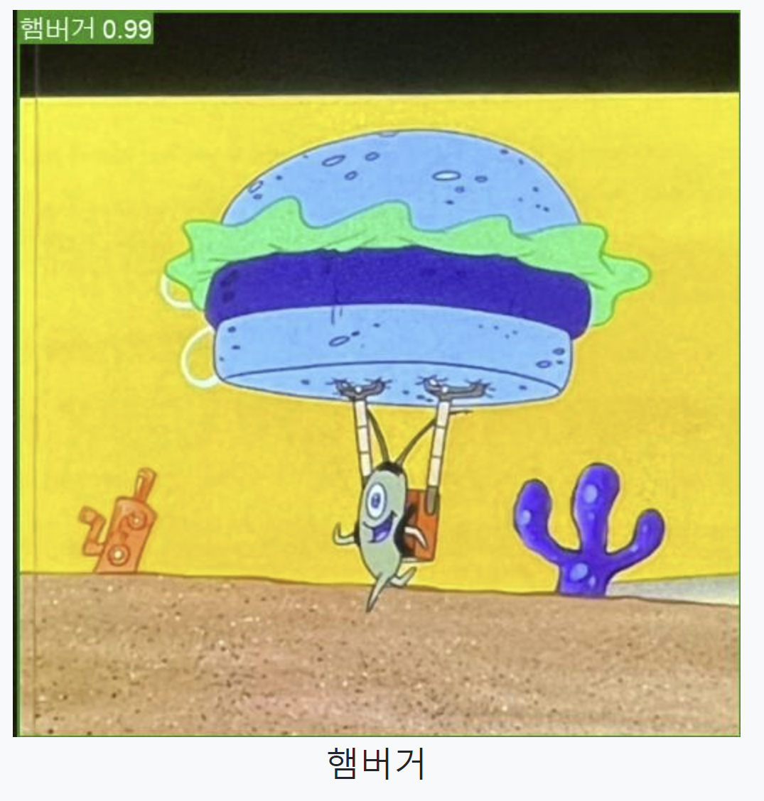

# Port8090 MiniProject

# Member

<table>
  <tbody>
    <tr>
      <td align="center"><a href="https://github.com/dayeah512"> <b>남다예</b></a> </td>
      <td align="center"><a href="https://github.com/byepingu"> <b>변영은</b></a> </td>
      <td align="center"><a href="https://github.com/hyul77"> <b>이준혁</b></a> </td>
      <td align="center"><a href="https://github.com/bbundnam"> <b>정세홍</b></a> </td>
      <td align="center"><a href="https://github.com/soljeong"> <b>정솔</b></a> </td>
      <td align="center"><a href="https://github.com/DaSeul-Seo"> <b>서다슬</b></a> </td>
    </tr>
  </tbody>
</table>

## ✍️ 요약

- 딥러닝을 활용한 음식사진 분류
- 시작날짜 : 2024년 01월 23일
- 완료날짜 : 2024년 01월 26일

## 🛠️ 사용 기술 및 라이브러리

- OS
  - Windows10 / Window11
- Language / Tool
  - Python / VisualStudioCode
  - HTML, CSS, JavaScript
- Framwork
  - Django
- Database / Tool
  - MariaDB
- 형상관리
  - Git
- Crawling
- Deep Learning
  - ObjectDetection : Yolov5 / Yolov8

## 🖥️ Crawling
1. 개인 크롤링 작업
2. 최종
  - 구글 이미지 검색
  - 총 18,336 데이터 수집
  - 정제 총 18,280 데이터 완료

## 🧠 Deep Learning (YOLOv8)
- TODO : 개념적기
- YOLOv5
  - 2020년 6월 출시
  - YOLOv4와 비교하여 객체 검출 정확도에서 10% 이상 향상되었으며, 더 빠른 속도와 더 작은 모델 크기를 가짐
- YOLOv8
  - 2023년 1월 출시
  - 개체 감지, 인스턴스 세분화 및 이미지 분류 모델을 train하기 위한 통합 프레임워크 로 구축됨
- YOLOv8를 사용한 이유
  - 가장 최신의 모델을 사용하기 위해
### 1. V1

| DataSet  | Labels | Pre-Trained Model Version |
| :---:         |     :---:      |          :---: |
| Train : 16636개의 jpg 파일  | 822개 Labels | YOLOv8n.pt |
| Valid : 1644개의 jpg 파일  |   |

### 2. V2

#### GPU

| DataSet  | Labels | Pre-Trained Model Version |
| :---:         |     :---:      |          :---: |
| Train : 16636개의 jpg 파일  | 822개 Labels | YOLOv8m.pt |
| Valid : 1644개의 jpg 파일  |   |

#### CPU

| DataSet  | Labels | Pre-Trained Model Version |
| :---:         |     :---:      |          :---: |
| Train : 14624개의 jpg 파일  | 15개 Labels | YOLOv8n.pt |
| Valid : 3656개의 jpg 파일  |   |

### 3. V3

| DataSet  | Labels | Pre-Trained Model Version |
| :---:         |     :---:      |          :---: |
| Train : 1200개의 jpg 파일  | 10개 Labels | YOLOv8n.pt |
| Valid : 300개의 jpg 파일  |   |

### V3 Results

## 🌐 Web
### ERD

## 💡 Issue

### YOLO 학습시
1. [Crawling] Selenium Version 문제
    - 웹크롤링시, XPATH 표기법의 변경으로 인해 동일한 사진만 저장되는 경우 발생
    - ❗ 문법 업데이트에 유의 필요

2. [Crawling] 세션을 유지하지 않고 여러 차례 request를 보내서 사이트에서 접속 차단당했다.

3. [YOLOv5] 예측 결과 사진파일에 바운딩박스가 미검출.
    - 학습 조건
      - class 10
      - train_img 100
      - valid_img 50
      - epoch 10
      - model version : YOLOv5
    - 원인
      - 학습량이 지나치게 적은 나머지 confidence score가 confidence threshold를 넘지 못해서 생긴 이슈.
      - 성능이 중요하지 않은 상황이라도 어느 정도는 정확성에 의의를 둬야 함.

4. [Hadoop] Hadoop을 사용하지 않을 수 없을 만큼 많은 양의 데이터를 수집하려고 했지만, 크롤링이 생각보다 쉽지 않았다.

- (보류)결과를 csv 파일로 저장해서 진행 => DB로 했어야 함

## ⭐ 개선점
- 학습 전 이미지 전처리
- 예측 결과 이미지에서 동일 라벨이 추출되었을 경우 confidence score가 가장 높은 값만 선택해서 표시
- 예측 결과 이미지 Filter 적용 문제 해결 필요